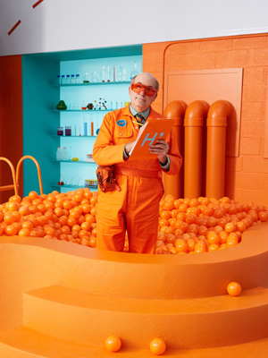
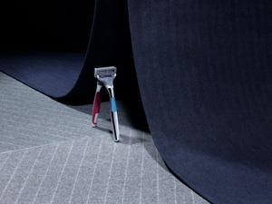
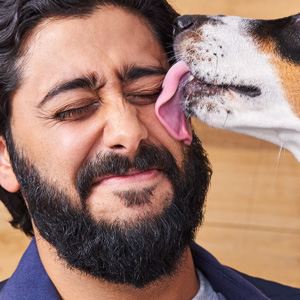
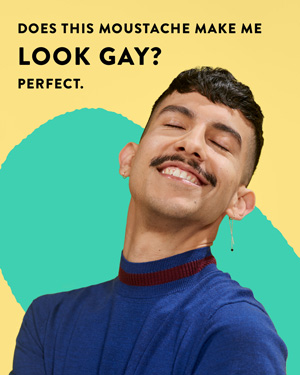
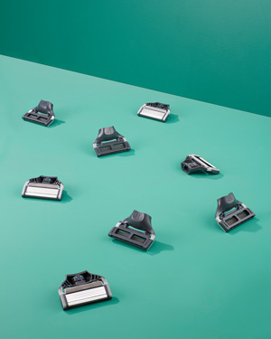
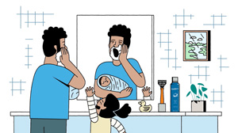
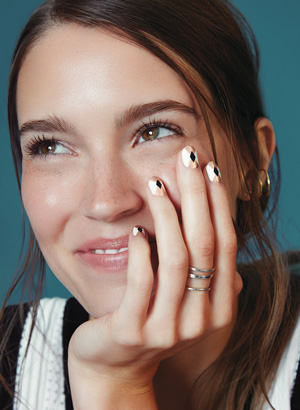
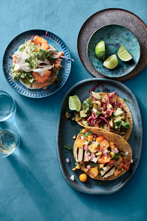
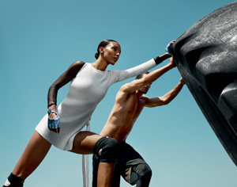
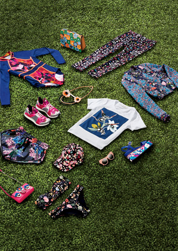

	<a href="{{ site.url }}/projects/engineered-for-enjoyment/">
		

	    
	    

	      <h5 class="card-title">Harry's: Engineered For Enjoyment</h5>
	    

	  

	</a>
	<a href="{{ site.url }}/projects/harrys-holiday-2018/">
		

	    
	    

	      <h5 class="card-title">Harry's: Holiday 2018</h5>
	    

	  

	</a>
	<a href="{{ site.url }}/projects/harrys-veterans-day-2018/">
		

	    
	    

	      <h5 class="card-title">Harry's: Veteran's Day 2018</h5>
	    

	  

	</a>
	<a href="{{ site.url }}/projects/harrys-holiday-2017/">
		

	    
	    

	      <h5 class="card-title">Harry's: Holiday 2017</h5>
	    

	  

	</a>
	<a href="{{ site.url }}/projects/harrys-hair/">
		

	    
	    

	      <h5 class="card-title">Harry's: Hair Launch</h5>
	    

	  

	</a>
	<a href="{{ site.url }}/projects/harrys-body/">
		

	    
	    

	      <h5 class="card-title">Harry's: Body Launch</h5>
	    

	  

	</a>
	<a href="{{ site.url }}/projects/harrys-holiday-2019/">
		

	    
	    

	      <h5 class="card-title">Harry's: Holiday 2019</h5>
	    

	  

	</a>
	<a href="{{ site.url }}/projects/harrys-heyday/">
		

	    
	    

	      <h5 class="card-title">Harry's X Heyday: Face Mask Campaign</h5>
	    

	  

	</a>
	<a href="{{ site.url }}/projects/harrys-pride-2019/">
		

	    
	    

	      <h5 class="card-title">Harry's: Pride 2019</h5>
	    

	  

	</a>
	<a href="{{ site.url }}/projects/harrys-pride-2018/">
		

	    
	    

	      <h5 class="card-title">Harry's: Pride 2018</h5>
	    

	  

	</a>
	<a href="{{ site.url }}/projects/harrys-product-pages/">
		

	    
	    

	      <h5 class="card-title">Harry's: Product Page Refresh</h5>
	    

	  

	</a>
	<a href="{{ site.url }}/projects/harrys-whatever-works/">
		

	    
	    

	      <h5 class="card-title">Harry's: Whatever Works For You</h5>
	    

	  

	</a>
	<a href="{{ site.url }}/projects/self-beauty/">
		

	    
	    

	      <h5 class="card-title">SELF Magazine: Beauty</h5>
	    

	  

	</a>
	<a href="{{ site.url }}/projects/self-food/">
		

	    
	    

	      <h5 class="card-title">SELF Magazine: Food</h5>
	    

	  

	</a>
	<a href="{{ site.url }}/projects/self-fashion/">
		

	    
	    

	      <h5 class="card-title">SELF Magazine: Fashion</h5>
	    

	  

	</a>
	<a href="{{ site.url }}/projects/self-still-life/">
		

	    
	    

	      <h5 class="card-title">SELF Magazine: Still Life</h5>
	    

	  

	</a>

